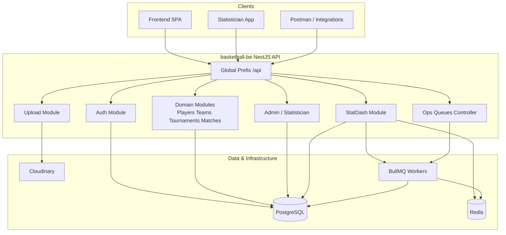
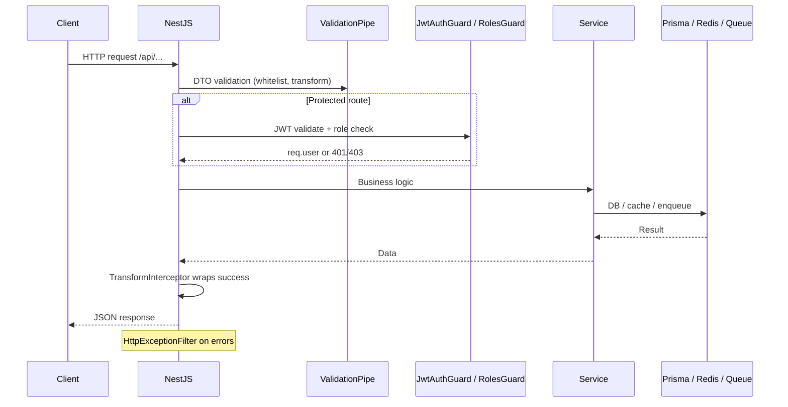
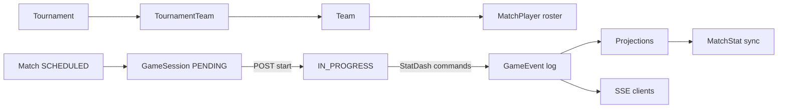
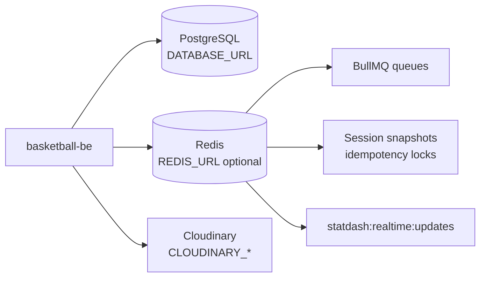

# 02 — Architecture Overview

[← Executive Summary](./01-executive-summary.md) | [Index](./README.md) | [Next: Getting Started →](./03-getting-started.md)

## High-level system diagram



## Request lifecycle



**Entry point:** `src/main.ts`
- Global prefix: `api`
- CORS from `CORS_ORIGINS` or allow-all if unset
- `ValidationPipe`: whitelist, forbidNonWhitelisted, transform
- Global filter: `HttpExceptionFilter`
- Global interceptors: `LoggingInterceptor`, `TransformInterceptor`

## Module / package structure

```
src/
├── main.ts                    # Bootstrap, CORS, validation, prefix
├── app.module.ts              # Root module wiring
├── auth/                      # JWT + Local auth, guards, strategies
├── admin/                     # SUPER_ADMIN user management
├── statistician/              # Statistician user CRUD + photo upload
├── players/                   # Player CRUD, dedup, bulk import
├── teams/                     # Team CRUD, captain
├── tournaments/               # Tournament CRUD, teams, flyer
├── matches/                   # Match scheduling and manual scores
├── upload/                    # Generic Cloudinary upload
├── statdash/                  # Live stats subsystem
│   ├── sessions/              # Bootstrap, start, state
│   ├── events/                # Commands, rules, corrections
│   ├── projections/           # Box score, shot chart, rebuild
│   └── realtime/              # SSE streaming
├── prisma/                    # PrismaService (global)
├── common/                    # Shared infra
│   ├── redis/                 # Cache, locks, pub/sub
│   ├── queue/                 # BullMQ + ops endpoints
│   ├── interceptors/
│   ├── filters/
│   └── services/              # PlayerDeduplicationService
└── logger/                    # Winston config (unused at runtime)
```

**Root module imports** (`src/app.module.ts`): ConfigModule, PrismaModule, CommonModule, AuthModule, PlayersModule, TeamsModule, TournamentsModule, MatchesModule, AdminModule, StatisticianModule, UploadModule, StatdashModule.

## Design patterns

| Pattern | Where used |
|---------|------------|
| NestJS modular architecture | Each domain = module + controller + service |
| DTO + class-validator | All request bodies (`dto/*.ts`) |
| Repository (light) | `statdash-sessions.repository.ts` |
| Guards + decorators | `JwtAuthGuard`, `RolesGuard`, `@Roles`, `@CurrentUser` |
| Global interceptors / filters | Response transform, logging, exception mapping |
| Event sourcing (partial) | StatDash: append-only `GameEvent`, projections |
| Optimistic concurrency | `GameSession.version` + `expectedVersion` on commands |
| Idempotency keys | Redis + `IdempotencyRecord` for StatDash commands |
| Provider abstraction | `IUploadProvider` → Cloudinary (`upload/`) |
| CQRS-like split | Commands (`events`) vs read models (`projections`) |

## Critical feature data flows

### A. Tournament setup → live game



### B. Player import with deduplication

1. `POST /api/players/team/bulk` or Excel upload
2. `PlayerDeduplicationService.findDuplicatePlayer()` — exact then fuzzy (75% threshold)
3. Reuse existing player or create new `Player` + `PlayerTeam` junction
4. See [06-core-domains.md](./06-core-domains.md#players)

### C. StatDash command write

1. Client sends `POST /api/statdash/events/command` with `idempotencyKey`, `expectedVersion`
2. Redis session lock → version check → rule engine → Prisma transaction
3. Invalidate caches → publish SSE → enqueue BullMQ jobs
4. See [07-statdash-realtime.md](./07-statdash-realtime.md)

## External dependencies



| Dependency | Required? | Failure mode |
|--------------|-----------|--------------|
| PostgreSQL | Yes | API errors (P1001 mapped to 503) |
| Redis | No | In-memory fallback; queues disabled |
| Cloudinary | For uploads only | Upload endpoints fail if misconfigured |

## Key file references

| Concern | File |
|---------|------|
| App bootstrap | `src/main.ts` |
| Module wiring | `src/app.module.ts` |
| DB access | `src/prisma/prisma.service.ts` |
| Schema | `prisma/schema.prisma` |
| StatDash root | `src/statdash/statdash.module.ts` |
| Rule engine | `src/statdash/events/rules/statdash-rule-engine.ts` |
| Redis service | `src/common/redis/redis.service.ts` |
| Queue service | `src/common/queue/queue.service.ts` |
