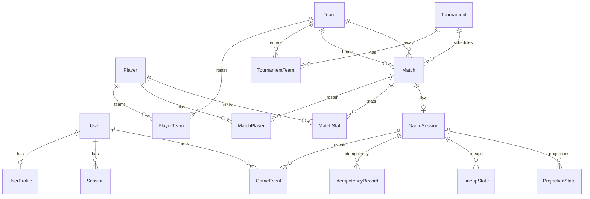

# 05 — Data Model

[← API Reference](./04-api-reference.md) | [Index](./README.md) | [Next: Core Domains →](./06-core-domains.md)

**Source of truth:** `prisma/schema.prisma`

## ER diagram

## Enums (business meaning)

| Enum | Values | Business meaning |
|------|--------|------------------|
| `Role` | `SUPER_ADMIN`, `ADMIN`, `STATISTICIAN` | Platform access level |
| `UserStatus` | `ACTIVE`, `INACTIVE` | Account enabled state |
| `TournamentDivision` | `PREMIER`, `DIVISION_1`–`DIVISION_3`, `JUNIOR` | Competition tier |
| `MatchStatus` | `SCHEDULED`, `LIVE`, `COMPLETED`, `CANCELLED`, `POSTPONED` | Match lifecycle (manual + StatDash) |
| `PlayerPosition` | `POINT_GUARD`, `SHOOTING_GUARD`, `SMALL_FORWARD`, `POWER_FORWARD`, `CENTER` | On-court position |
| `GameSessionStatus` | `PENDING`, `IN_PROGRESS`, `PAUSED`, `COMPLETED`, `CANCELLED` | Live stat session state |

## Models

### User

| Field | Type | Notes |
|-------|------|-------|
| `id` | cuid | PK |
| `email` | String? unique | Login identifier |
| `password` | String? | bcrypt hash |
| `name` | String? | Display fallback |
| `role` | Role | Default `STATISTICIAN` |
| `status` | UserStatus | Default `ACTIVE` |
| `emailVerified` | Boolean | Default false |
| `createdAt`, `updatedAt` | DateTime | |

Relations: `profile`, `sessions`, `gameEvents` (StatDash actor).

Table: `user`

### UserProfile

Extended profile for admins/statisticians. One-to-one with `User`, cascade delete.

Notable fields: `fullName`, `photos` (String[]), `division`, DOB parts, contact info.

Table: `user_profile`

### Session

JWT session persistence. `access_token` unique; optional `refreshToken`; `expires` DateTime.

Cascade delete with user. Table: `session`

### Team

| Field | Notes |
|-------|-------|
| `code` | Unique short code (e.g. LAL) |
| `color`, `logo`, `coach`, `assistantCoach` | Branding / staff |

Relations: `playerTeams`, `tournamentTeams`, `homeMatches`, `awayMatches`, `matchPlayers`.

Table: `team`

### Player

Independent entity (not tied to single team). Indexed on `[firstName, lastName]` and `email`.

| Field | Notes |
|-------|-------|
| `email` | Unique when set |
| `position` | PlayerPosition enum |
| `dateOfBirth` | Used in deduplication |

Table: `player`

### PlayerTeam

Many-to-many junction with jersey and timeline.

| Field | Notes |
|-------|-------|
| `jerseyNumber` | Per-team |
| `isActive` | Current roster vs historical |
| `isCaptain` | One captain per team (enforced in service) |
| `joinedAt`, `leftAt` | Tenure |

Indexes: `[teamId, isActive]`, `[playerId, teamId]`. Cascade delete.

Table: `player_team`

### Tournament

| Field | Notes |
|-------|-------|
| `division` | TournamentDivision |
| `numberOfGames`, `numberOfQuarters`, `quarterDuration`, `overtimeDuration` | Rules config |
| `code` | Unique lookup key |
| `flyer` | URL after upload |
| Officials: `crewChief`, `umpire1`, `umpire2`, `commissioner` | |

Table: `tournament`

### TournamentTeam

`@@unique([tournamentId, teamId])`. Cascade delete.

Table: `tournament_team`

### Match

| Field | Notes |
|-------|-------|
| `status` | MatchStatus, default SCHEDULED |
| `homeScore`, `awayScore` | Aggregate; also updated by StatDash rebuild |
| `quarter1Home` … `quarter4Away`, `overtimeHome/Away` | Manual quarter breakdown |

One `GameSession` per match (`matchId` unique on GameSession).

Table: `match`

### MatchPlayer

Which player played for which team in a specific match.

`@@unique([matchId, playerId, teamId])`. Index `[matchId, teamId]`.

Table: `match_player`

### MatchStat

Aggregated per-match player stats (points, rebounds, assists, blocks, steals, fouls, turnovers, minutesPlayed).

`@@unique([matchId, playerId, teamId])`. Synced from StatDash `rebuildAndPersist`.

Table: `match_stat`

### GameSession

Live stat session (StatDash). 1:1 with Match.

| Field | Notes |
|-------|-------|
| `version` | Optimistic concurrency counter |
| `quarter`, `clockSecondsRemaining` | Default clock 600s (10 min) |
| `possessionTeamId`, `jumpBallWinnerTeamId` | Possession tracking |
| `homeOnLeft`, `homeAttacksLeft` | Court orientation |
| `startedAt`, `endedAt` | Session timing |

Index: `[status, updatedAt]`. Table: `game_session`

### GameEvent

Append-only event log.

| Field | Notes |
|-------|-------|
| `sequence` | Per-session ordering |
| `eventType` | String (shot, foul, correction, etc.) |
| `payload` | JSON |
| `expectedVersion`, `resultingVersion` | Concurrency audit |
| `idempotencyKeyId` | Optional FK |

`@@unique([sessionId, sequence])`. Actor FK to User (`onDelete: Restrict`).

Table: `game_event`

### IdempotencyRecord

| Field | Notes |
|-------|-------|
| `key` | Client idempotency key |
| `requestHash` | SHA-256 of command |
| `responseSnapshot` | Cached API response |
| `expiresAt` | TTL (~24h) |

`@@unique([sessionId, key])`. Table: `idempotency_record`

### LineupState

Snapshot of on-court lineups per quarter. JSON `homeLineup`, `awayLineup`.

Table: `lineup_state`

### ProjectionState

Materialized projection payloads (box score, etc.).

`@@unique([sessionId, projectionType])`. Table: `projection_state`

## Migration history summary

| Migration folder | Approx. purpose |
|------------------|-----------------|
| `20251026032640_init` | Early init |
| `20260208161138_init` | Schema init iteration |
| `20260311000000_add_junior_division` | Add `JUNIOR` to TournamentDivision |
| `20260311213035_init` | SUPER_ADMIN role, user status, player gender/nationality, captain flag |
| `20260502000000_add_statdash_tables` | GameSession, GameEvent, IdempotencyRecord, LineupState, ProjectionState |

Multiple `*_init` migrations suggest iterative development / squashing history. Always run `prisma migrate deploy` against target DB rather than assuming clean linear history.

Lock file: `prisma/migrations/migration_lock.toml` — provider `postgresql`.

## Seed data

**File:** `prisma/seed.ts`  
**Run:** `npm run seed`

| Creates | Values |
|---------|--------|
| User | `test@basketball.com` / `password123`, role `ADMIN` |
| Profile | `fullName: "Test Admin"` |

Does not seed teams, tournaments, or matches. Customize by editing `prisma/seed.ts`.

Note: `package.json` has `"seed": "ts-node prisma/seed.ts"` but Prisma `prisma.seed` block in schema is not configured — use npm script directly.

## Data integrity rules

| Rule | Implementation |
|------|----------------|
| Cascade deletes | Most child tables cascade from parent (tournament → matches, etc.) |
| Soft delete (players) | `remove()` / `removeFromTeam()` set `isActive: false`, `leftAt` — player row retained |
| Hard delete | `DELETE` endpoints remove rows (admin only on most entities) |
| Email uniqueness | `User.email`, `Player.email` |
| Team code uniqueness | `Team.code` |
| Tournament code uniqueness | `Tournament.code` |
| Match-player uniqueness | One row per (match, player, team) |
| Game event ordering | Unique `(sessionId, sequence)` |
| StatDash actor | `GameEvent.actorUserId` cannot delete user if events exist (`Restrict`) |

## Known data quirks / legacy

| Quirk | Detail |
|-------|--------|
| Dual score sources | `Match.homeScore/awayScore` and `GameSession.homeScore/awayScore` — rebuild syncs from events |
| Session status unused values | `PAUSED`, `COMPLETED`, `CANCELLED` in enum but no StatDash transitions |
| `User.name` vs `UserProfile.fullName` | Auth returns profile name first |
| `Session.expires` vs JWT expiry | Session row uses hardcoded +24h; JWT uses `JWT_EXPIRES_IN` |
| Box score raw vs replay | `buildBoxScoreFromEvents` may count reversed events; score replay does not |

## Cross-references

- StatDash tables: [07-statdash-realtime.md](./07-statdash-realtime.md)
- Player dedup: [06-core-domains.md](./06-core-domains.md#players)
