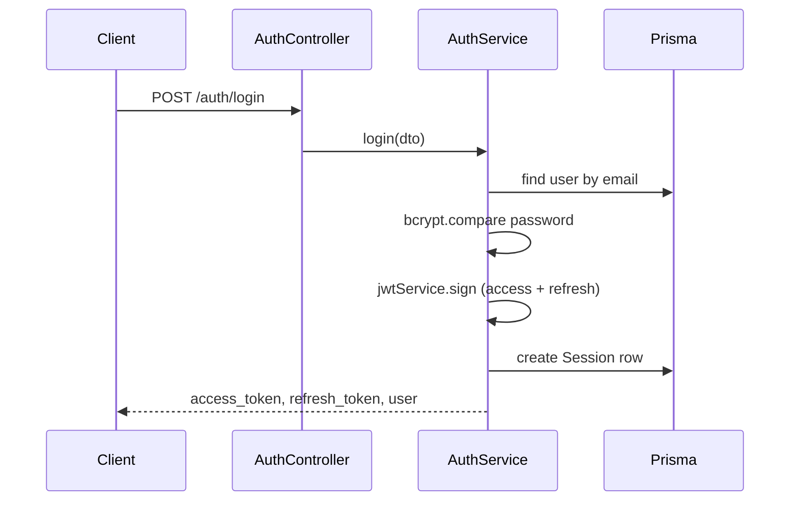
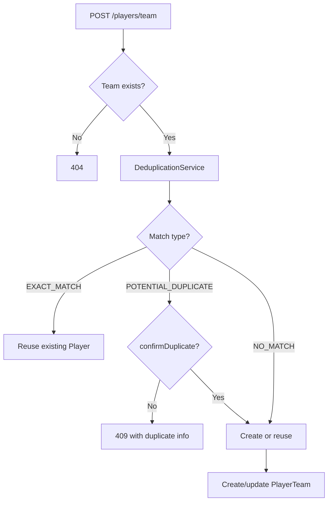
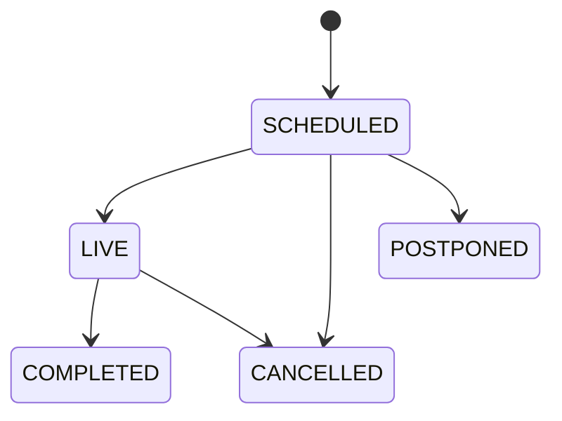

# 06 — Core Domains

[← Data Model](./05-data-model.md) | [Index](./README.md) | [Next: StatDash →](./07-statdash-realtime.md)

This document covers domains outside StatDash (which has its own deep-dive in [07-statdash-realtime.md](./07-statdash-realtime.md)).

---

## Auth

### Purpose

JWT-based authentication for all API consumers. Supports registration, login, and profile retrieval.

### User stories

- As a statistician, I log in and receive a JWT to call protected endpoints.
- As an admin, I register the first users (or use seed) and manage sessions implicitly via login.

### Key files

| File | Role |
|------|------|
| `src/auth/auth.module.ts` | JwtModule config |
| `src/auth/auth.controller.ts` | Routes |
| `src/auth/auth.service.ts` | Login, register, validateUser |
| `src/auth/strategies/jwt.strategy.ts` | Bearer + query token extraction |
| `src/auth/strategies/local.strategy.ts` | Email/password for login |
| `src/auth/guards/jwt-auth.guard.ts` | JWT protection |
| `src/auth/guards/local-auth.guard.ts` | Login guard |
| `src/auth/guards/roles.guard.ts` | RBAC |
| `src/auth/decorators/roles.decorator.ts` | `@Roles()` |
| `src/auth/decorators/current-user.decorator.ts` | `@CurrentUser()` |

### Main workflow: login

### Validation and edge cases

- Invalid credentials → `401 Unauthorized`
- Register duplicate email → `409 Conflict`
- Register allows setting `role` in body — security concern in production
- No logout / token revocation endpoint (sessions accumulate)
- No refresh endpoint despite `refresh_token` in response

### Integrations

All modules use `JwtAuthGuard` at controller level.

---

## Admin

### Purpose

`SUPER_ADMIN`-only CRUD for platform administrator accounts.

### Key files

- `src/admin/admin.controller.ts`
- `src/admin/admin.service.ts`
- `src/admin/dto/create-admin.dto.ts`, `update-admin.dto.ts`

### Workflow

1. Super admin authenticates
2. `POST /api/admin` creates user with role `ADMIN` + optional profile fields
3. List/get/update/delete via standard REST

### Validation

- Service checks caller is `SUPER_ADMIN` (defense in depth with guard)
- Password hashed with bcrypt (10 rounds)

`[UNKNOWN — needs owner input]` — How is the first `SUPER_ADMIN` created? Not in seed (seed creates `ADMIN` only).

---

## Statistician (user management)

### Purpose

Manage statistician user accounts (not to be confused with the StatDash stats subsystem).

### Key files

- `src/statistician/statistician.controller.ts`
- `src/statistician/statistician.service.ts`
- `src/statistician/dto/create-statistician.dto.ts`

### Workflow

1. Admin creates statistician (`POST /statistician`) — role `STATISTICIAN`
2. Optional photo upload via Cloudinary (`PATCH /:id/photo`)
3. Admin/Super admin can list, update, delete

### Access

`SUPER_ADMIN` or `ADMIN` for all mutating and read operations.

---

## Players

### Purpose

Independent player registry with multi-team support, fuzzy deduplication, bulk import, and merge.

### Key files

| File | Role |
|------|------|
| `src/players/players.controller.ts` | HTTP layer |
| `src/players/players.service.ts` | Business logic (~1000 lines) |
| `src/common/services/player-deduplication.service.ts` | Duplicate detection |
| `src/common/utils/string-similarity.util.ts` | Levenshtein, Jaro-Winkler |
| `src/players/dto/*.ts` | DTOs |

### User stories

- Import roster via Excel for a team
- Detect duplicate players before creating records
- Assign same player to multiple teams with different jersey numbers
- Merge duplicate profiles (admin)

### Workflow: create for team with dedup

### Validation rules

| Rule | Behavior |
|------|----------|
| Exact duplicate (name + DOB) | Error on standalone create; reuse on team create |
| Fuzzy duplicate (≥75% similarity) | `409` with `requiresConfirmation: true` unless `confirmDuplicate: true` |
| Jersey uniqueness | Per team, active roster |
| Email uniqueness | Global on `Player.email` |
| Excel upload | Parses via `xlsx`; expects template columns |

### Edge cases

- `remove()` deactivates all `PlayerTeam` rows, does not delete `Player` or `MatchStat` history
- `mergePlayers()` reassigns relations from duplicate to target (admin only)
- Bulk upload may report duplicates without blocking entire batch (see service comments)

### Integrations

- Teams: `PlayerTeam` junction
- Matches: `MatchPlayer`, `MatchStat`
- StatDash: player IDs in event payloads

---

## Teams

### Purpose

Team registry with unique codes, roster via `PlayerTeam`, tournament membership.

### Key files

- `src/teams/teams.service.ts`
- `src/teams/teams.controller.ts`
- `src/teams/dto/set-captain.dto.ts`

### Workflow: set captain

1. `PATCH /teams/:id/players/:playerId/captain` with `{ isCaptain: true }`
2. Service unsets previous captain on same team
3. Sets `isCaptain` on target `PlayerTeam`

### Validation

- Unique `code` on create
- `?tournamentId=` filter joins through `TournamentTeam`

### Integrations

- Tournaments, Matches, StatDash possession/team IDs

---

## Tournaments

### Purpose

Tournament configuration (divisions, quarter length, officials) and team enrollment.

### Key files

- `src/tournaments/tournaments.service.ts`
- `src/tournaments/tournaments.controller.ts`

### Workflow: create tournament

1. `POST /tournaments` with division, dates, game/quarter settings
2. Service generates unique `code` from name
3. `POST /:id/teams` adds teams via `TournamentTeam`
4. Matches reference `tournamentId`; both teams must be enrolled

### Validation

- `division` must be valid `TournamentDivision` enum
- Flyer upload stores Cloudinary URL on `flyer` field

### Integrations

- Matches scoped to tournament
- StatDash `resolveMatchKey` can use tournament `code`

---

## Matches

### Purpose

Schedule games, track status and scores (manual PATCH path alongside StatDash).

### Key files

- `src/matches/matches.service.ts`
- `src/matches/matches.controller.ts`

### Lifecycle

Status changes via `PATCH /matches/:id` (`UpdateMatchDto`). StatDash does not auto-update `Match.status` to `LIVE` on session start (verify client behavior).

### Workflow: create match

1. Validate tournament exists
2. Validate home/away teams are in `TournamentTeam`
3. Create `Match` with `SCHEDULED` default
4. StatDash bootstrap can create `GameSession` separately

### Integrations

- `GameSession` 1:1 with `Match`
- `MatchStat` populated by StatDash rebuild

---

## Upload

### Purpose

Generic file upload to Cloudinary; also used internally by tournaments and statistician modules.

### Key files

- `src/upload/upload.service.ts` (`CloudinaryService`)
- `src/upload/cloudinary.provider.ts`
- `src/upload/upload.controller.ts`
- `src/upload/interfaces/upload-provider.interface.ts`

### Workflow

1. Multipart `file` field
2. Stream buffer to Cloudinary `upload_stream`
3. Return `{ url: secure_url, publicId }`

### Security note

`POST /api/upload` has **no authentication**. See [09-security-and-auth.md](./09-security-and-auth.md).

---

## Queue (ops domain)

Not a business domain but operational surface for admins.

See [08-background-jobs-and-integrations.md](./08-background-jobs-and-integrations.md).

---

## Cross-domain setup sequence

Typical greenfield flow for a new tournament weekend:

1. **Auth** — Login as admin/statistician
2. **Teams** — Create teams with codes
3. **Players** — Bulk import per team
4. **Tournaments** — Create tournament, add teams
5. **Matches** — Schedule games
6. **StatDash** — Bootstrap session, start, record events (see [07](./07-statdash-realtime.md))
7. **Projections** — Box score / rebuild syncs `MatchStat`
