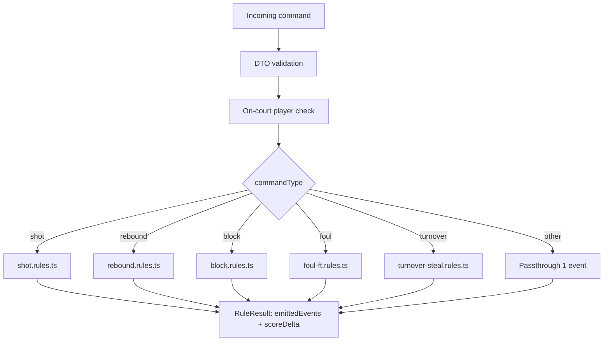
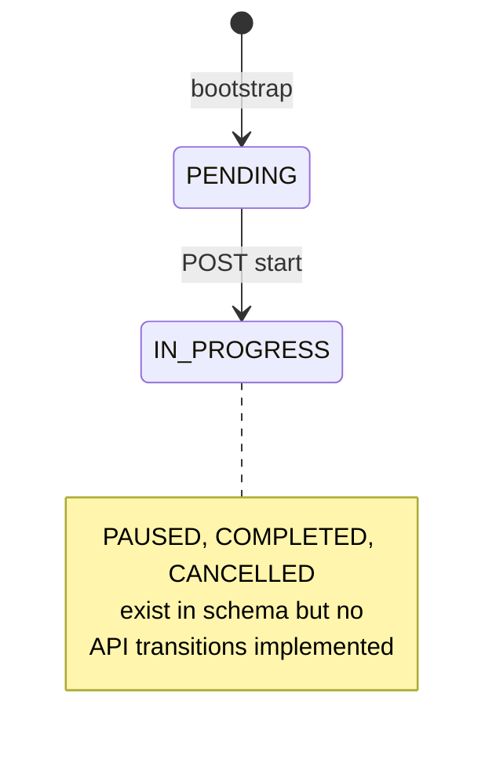
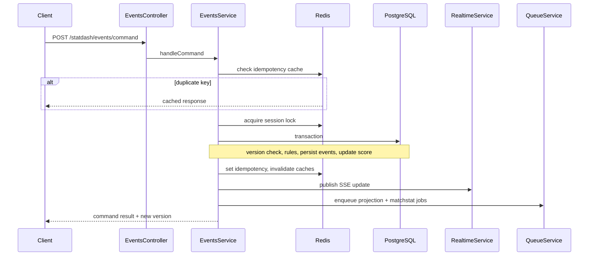

# 07 — StatDash Realtime (Deep Dive)

[← Core Domains](./06-core-domains.md) | [Index](./README.md) | [Next: Background Jobs →](./08-background-jobs-and-integrations.md)

StatDash is the most complex subsystem: event-sourced live basketball statistics with optimistic concurrency, a rule engine, projections, SSE realtime, and async cache invalidation.

**Root module:** `src/statdash/statdash.module.ts`

## Submodule map

| Submodule | Path | Responsibility |
|-----------|------|----------------|
| Sessions | `src/statdash/sessions/` | Bootstrap, match-key resolution, start, state snapshots |
| Events | `src/statdash/events/` | Command ingestion, rules, corrections, reversals |
| Projections | `src/statdash/projections/` | Box score, shot chart, rebuild, MatchStat sync |
| Realtime | `src/statdash/realtime/` | SSE streaming, Redis pub/sub fan-out |
| Contracts | `src/statdash/contracts/` | Shared types, event enums, payload shapes |

## Event model

### Command types (client → API)

Defined in `src/statdash/contracts/event-types.ts`:

`shot`, `assist`, `rebound`, `block`, `foul`, `free_throw`, `turnover`, `steal`, `dead_ball`, `substitution`, `jump_ball`, `timeout`, `clock`

### Stored event types

Same 13 gameplay types plus meta events:

| Type | Created by |
|------|------------|
| `correction` | `PATCH /statdash/events/:eventId/correct` |
| `reversal` | `POST /statdash/events/:eventId/reverse` |

### Command envelope

`StatdashCommandDto` (`src/statdash/events/dto/statdash-command.dto.ts`):

```json
{
  "sessionId": "cuid",
  "commandType": "shot",
  "payload": { },
  "expectedVersion": 42,
  "idempotencyKey": "uuid-from-client"
}
```

Payload validated per-type via `validate-command-payload.ts` + class-validator.

### Supporting enums

| Constant | Values |
|----------|--------|
| `STATDASH_SHOT_RESULTS` | `made`, `missed` |
| `STATDASH_REBOUND_TYPES` | `offensive`, `defensive` |
| `STATDASH_DEAD_BALL_REASONS` | `out_of_bounds`, `shot_clock_violation`, `held_ball`, `lane_violation` |

## Rule engine

**Entry:** `src/statdash/events/rules/statdash-rule-engine.ts` → `applyCommandRules(commandType, payload, context)`



### Rule fan-out examples

| Command | May emit |
|---------|----------|
| Missed shot + rebound decision | `shot` + `rebound` (+ optional follow-up `shot`) |
| Foul with free throws | `foul` + N × `free_throw` (+ rebound branch on last miss) |
| Turnover + steal | `turnover` + `steal` |
| Block + repeat rebound | `block` + `dead_ball` |

### Lineup validation

`lineup-validation.rules.ts` — if a `LineupState` snapshot exists, actor player IDs must be on court.

## Sessions

### Lifecycle (implemented vs schema)



| Status | How reached |
|--------|-------------|
| `PENDING` | `bootstrap` or `createSessionSeed` |
| `IN_PROGRESS` | `POST /statdash/sessions/:sessionId/start` |
| `PAUSED`, `COMPLETED`, `CANCELLED` | **Not implemented** in StatDash services |

### Key endpoints

| Endpoint | Service method | Behavior |
|----------|----------------|----------|
| `POST .../resolve-match-key` | `resolveMatchKey` | Find match by ID or tournament code |
| `POST .../bootstrap` | `bootstrap` | Load/create session + snapshot |
| `POST .../:sessionId/start` | `startSession` | Set IN_PROGRESS |
| `GET .../:sessionId/state` | `getState` | Same as bootstrap by sessionId |

### Bootstrap snapshot fields

`sessionId`, `matchId`, `status`, `quarter`, `clockSecondsRemaining`, `score`, `orientation`, `jumpBallWinnerTeamId`, `possessionTeamId`, `activeLineups`, `recentEvents` (last 25), `version`, `startedAt`, `endedAt`

Cached in Redis `statdash:session:{id}:snapshot` (30s TTL).

## Command write flow



**File:** `src/statdash/events/statdash-events.service.ts`

Transaction options for serverless Postgres: `maxWait: 15s`, `timeout: 30s`.

## Versioning and idempotency

### Optimistic concurrency

- Client sends `expectedVersion` matching `GameSession.version`
- Mismatch → `409` with code `SD_VERSION_CONFLICT` and `latestVersion`
- On success, version increments by number of events emitted in batch

### Idempotency

| Layer | Mechanism |
|-------|-----------|
| Hash | SHA-256 of `{ sessionId, commandType, payload, expectedVersion }` |
| Redis | `statdash:session:{id}:idem:{key}` — 24h TTL |
| DB | `IdempotencyRecord` with `@@unique([sessionId, key])` |
| Lock | `statdash:session:{id}:lock` — 3s PX NX |

Same key + different hash → `SD_IDEMPOTENCY_KEY_REUSED_DIFFERENT_REQUEST`  
Lock busy → `SD_SESSION_LOCK_BUSY`

## Corrections and reversals

| Operation | Endpoint | Effect |
|-----------|----------|--------|
| Correct | `PATCH .../events/:eventId/correct` | Appends `correction` meta-event; full score replay |
| Reverse | `POST .../events/:eventId/reverse` | Appends `reversal` meta-event; full score replay |

`replayScoreFromEvents()` in projections service applies correction/reversal semantics. Sets `version = events.length` after replay.

Enqueues `session.recompute` BullMQ job and invalidates caches.

## Projections

**Service:** `src/statdash/projections/statdash-projections.service.ts`

| Endpoint | Method | Output |
|----------|--------|--------|
| `.../box-score` | Replay events → per-player totals | points, rebounds, etc. |
| `.../shot-chart` | Filter `shot` events with coordinates | Shot locations |
| `.../player/:playerId/game/:sessionId` | Single player slice | |
| `.../summary` | Session score + aggregates | |
| `.../rebuild` | `rebuildAndPersist` | Updates `ProjectionState`, `Match` scores, `MatchStat` rows |

Redis projection cache: `statdash:session:{id}:projection:{type}` (60s; summary 30s).

### Known projection gap

`buildBoxScoreFromEvents` counts raw events and may **not** honor correction/reversal semantics, while `replayScoreFromEvents` does. Score on `GameSession` uses replay logic after corrections.

## Realtime (SSE)

**Not WebSockets.**

| Item | Detail |
|------|--------|
| Endpoint | `GET /api/statdash/realtime/sessions/:sessionId/stream` |
| Auth | JWT via header or `?access_token=` query param |
| Query | `?sinceVersion=N` — replay buffered updates with version > N |
| Event name | `statdash-update` |
| Payload | `{ sessionId, source, state: { version, score }, deltaEvents }` |

**Service:** `src/statdash/realtime/statdash-realtime.service.ts`

- In-process RxJS `Subject` + ring buffer (max 200 updates per session)
- Redis channel `statdash:realtime:updates` for multi-instance fan-out
- Publishes after successful command, correct, reverse

### Client integration pattern

1. Bootstrap session → get `version`
2. Open EventSource with `access_token` query param
3. On each `statdash-update`, merge `deltaEvents` and update UI score from `state`
4. Fallback: poll `GET .../sessions/:sessionId/state`

## Async processing (BullMQ)

After writes, jobs are enqueued (when `REDIS_URL` set):

| Job | Queue | Worker action |
|-----|-------|---------------|
| `projection.rebuild` | statdash-projections | Invalidate projection + snapshot caches |
| `matchstat.sync` | statdash-matchstat-sync | Log only (no DB write in worker) |
| `session.recompute` | statdash-recompute | Invalidate caches on correct/reverse |
| `session.replay.backfill` | statdash-recompute | Triggered on manual rebuild |

Workers do **not** call `rebuildAndPersist` — full rebuild is synchronous via `POST .../rebuild`.

See [08-background-jobs-and-integrations.md](./08-background-jobs-and-integrations.md).

## Testing strategy

| File | Coverage |
|------|----------|
| `statdash-events.service.spec.ts` | Idempotency, version conflict, correct/reverse, realtime publish |
| `statdash-rules.spec.ts` | Shot, rebound, block, foul, turnover rules |
| `statdash-projections.service.spec.ts` | Score replay with correction/reversal |
| `statdash-realtime.service.spec.ts` | SSE filtering, sinceVersion, Redis bridge |
| `statdash-sessions.service.spec.ts` | Bootstrap, resolveMatchKey, start guards |
| `validate-command-payload.spec.ts` | DTO validation |
| `test/statdash-verification.e2e-spec.ts` | E2E scenarios E2E-01–05 |

Verification results: `docs/statdash-be-verification-results.md` (dated 2026-04-27).

### Recommended manual QA for StatDash releases

- [ ] Bootstrap + start session for a match with roster
- [ ] Record made/missed shot with rebound branch
- [ ] Record foul → free throw sequence
- [ ] Verify SSE receives updates (two browser tabs)
- [ ] Retry same command with same idempotency key → identical response
- [ ] Stale version → 409 conflict
- [ ] Correct a shot → score updates after replay
- [ ] Rebuild projections → `MatchStat` rows updated

## Clock and possession gap

Commands `clock`, `jump_ball`, `substitution`, `timeout` are persisted as events but **`StatdashEventsService` does not update** `GameSession.quarter`, `clockSecondsRemaining`, or possession fields from those commands. Session clock defaults to 600 seconds at quarter 1 unless updated elsewhere.

`[UNKNOWN — needs owner input]` — Is clock management client-side only today?
