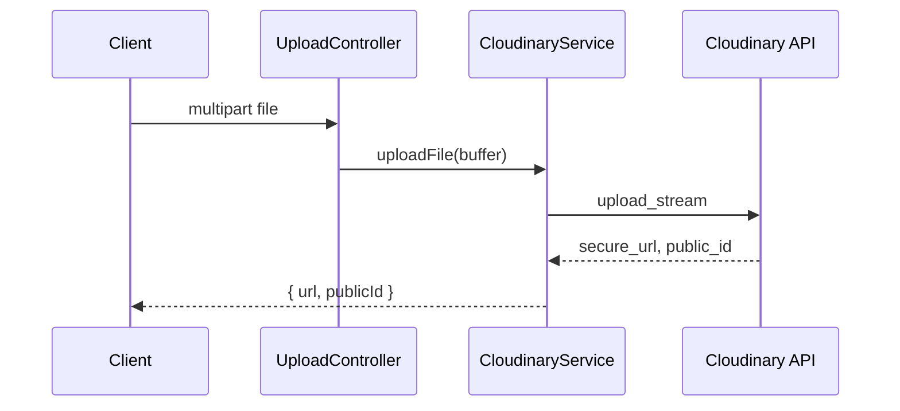

# 08 — Background Jobs and Integrations

[← StatDash](./07-statdash-realtime.md) | [Index](./README.md) | [Next: Security →](./09-security-and-auth.md)

## Overview

| Integration | Required | Activation |
|-------------|----------|------------|
| PostgreSQL | Yes | `DATABASE_URL` |
| Redis | No | `REDIS_URL` — enables cache, locks, pub/sub, BullMQ |
| Cloudinary | For uploads | `CLOUDINARY_*` env vars |
| BullMQ | No | Same `REDIS_URL` |
| Email / SMS / Payments | **Not implemented** | — |
| Webhooks | **Not implemented** | — |

---

## BullMQ queue workers

**Files:**
- `src/common/queue/queue.module.ts`
- `src/common/queue/queue.service.ts`
- `src/common/queue/queue-worker.service.ts`
- `src/common/queue/queue.controller.ts`

### Activation

If `REDIS_URL` is unset:
- `QueueService` logs warning and all enqueue methods no-op safely
- `getQueueHealth()` returns `{ enabled: false, queues: {} }`

### Queues

| Queue name | Worker? | Purpose |
|------------|---------|---------|
| `statdash-projections` | Yes | Cache invalidation after commands |
| `statdash-recompute` | Yes | Cache invalidation after correct/reverse/rebuild |
| `statdash-matchstat-sync` | Yes | Lightweight sync logging (no DB write) |
| `statdash-dlq` | No | Dead-letter storage |

### Job types

| Job name | Queue | Payload | Triggered from |
|----------|-------|---------|----------------|
| `projection.rebuild` | statdash-projections | `{ sessionId, reason }` | After StatDash commands, warm endpoint |
| `matchstat.sync` | statdash-matchstat-sync | `{ sessionId }` | After commands, rebuild, warm |
| `session.recompute` | statdash-recompute | `{ sessionId, eventId, operation }` | Correct/reverse |
| `session.replay.backfill` | statdash-recompute | `{ sessionId, fromSequence }` | Manual rebuild, warm |
| `dlq.recovery` | statdash-dlq | Failed job metadata | On worker failure |

### Dedup job IDs

Prevents duplicate jobs for same session/version:
- `projection:{sessionId}:{dedupKey}`
- `matchstat:{sessionId}:{dedupKey}`
- `recompute:{operation}:{eventId}:{dedupKey}`
- `replay:{sessionId}:{dedupKey}`

Default `dedupKey` = `"latest"`; event writes use version strings.

### Retry behavior

From `queue.service.ts` (`withJobPolicy`):

| Setting | Value |
|---------|-------|
| attempts | 5 |
| backoff | exponential, 1000ms initial |
| removeOnComplete | true |
| removeOnFail | false |

On final failure, `pushToDeadLetter()` stores job on `statdash-dlq`.

### DLQ recovery

`POST /api/ops/queues/dead-letter/requeue?limit=25` (ADMIN/SUPER_ADMIN)

Reads waiting/failed DLQ jobs, re-adds to original queue, removes from DLQ.

### Worker implementation note

Workers primarily **invalidate Redis caches** — they do not run full `rebuildAndPersist`. Match stat sync worker only logs JSON (`queue.matchstat.sync.completed`).

---

## Redis usage

**File:** `src/common/redis/redis.service.ts`

### Connections

| Client | Purpose |
|--------|---------|
| `redisClient` | GET/SET/DEL, locks, publish |
| `redisSubscriber` | Subscribe to realtime channel |

`lazyConnect: true`, `maxRetriesPerRequest: 2` (BullMQ uses separate connection with `maxRetriesPerRequest: null`).

### Application key patterns

| Key | TTL | Purpose |
|-----|-----|---------|
| `statdash:session:{sessionId}:snapshot` | 30s | Session state cache |
| `statdash:session:{sessionId}:recent_events` | 30s | Last 25 events |
| `statdash:session:{sessionId}:projection:{type}` | 60s (summary 30s) | Box score, shot chart, summary |
| `statdash:session:{sessionId}:idem:{key}` | 24h | Idempotency fast path |
| `statdash:session:{sessionId}:lock` | 3000ms | Write lock (PX NX) |

### Pub/sub

| Channel | Purpose |
|---------|---------|
| `statdash:realtime:updates` | Cross-instance SSE fan-out |

### In-memory fallback

When `REDIS_URL` unset: `Map`-based TTL emulation. **Not suitable for production multi-instance.**

### BullMQ Redis keys

Managed by BullMQ under `bull:{queueName}:*` namespace (not defined in app code).

---

## Cloudinary file upload

**Files:** `src/upload/upload.service.ts`, `cloudinary.provider.ts`

### Configuration

| Env var | Purpose |
|---------|---------|
| `CLOUDINARY_CLOUD_NAME` | Cloud name |
| `CLOUDINARY_API_KEY` | API key |
| `CLOUDINARY_API_SECRET` | API secret |

### Flow

### Upload entry points

| Endpoint | Field name | Auth |
|----------|------------|------|
| `POST /api/upload` | `file` | **None** |
| `PATCH /api/tournaments/:id/flyer` | `flyer` | JWT + role |
| `PATCH /api/statistician/:id/photo` | `photo` | JWT + role |
| `POST /api/players/team/:teamId/upload` | `file` | JWT + role |

### Limits

No explicit file size limits in code — governed by NestJS/multer defaults and Cloudinary account limits.

### Future S3

`.env.example` comments reference AWS S3 vars. `IUploadProvider` abstraction supports swapping provider via `UPLOAD_PROVIDER` token.

---

## Email / SMS / payments

**Not present in codebase.** No nodemailer, Twilio, Stripe, or similar dependencies in `package.json`.

---

## Webhooks

**Not implemented.** No inbound webhook controllers or outbound webhook dispatch.

---

## Rate limits

**Not implemented.** No `@nestjs/throttler` or custom rate limiting middleware.

---

## Failure handling summary

| Failure | Behavior |
|---------|----------|
| Redis down (with URL set) | Connection errors; depends on call site |
| Redis unset | Graceful in-memory fallback |
| Queue job failure | 5 retries → DLQ |
| Cloudinary misconfig | Upload throws at runtime |
| Prisma errors | Mapped by `HttpExceptionFilter` (P1001 → 503, P2002 → 409) |

---

## Ops endpoints

See [04-api-reference.md](./04-api-reference.md#ops--queues--srccommonqueuequeuecontrollerts).

| Endpoint | Purpose |
|----------|---------|
| `GET /api/ops/queues/health` | Per-queue job counts |
| `GET /api/ops/queues/lag` | Oldest waiting job age |
| `POST /api/ops/queues/dead-letter/requeue` | DLQ recovery |
| `POST /api/ops/queues/warm/session` | Pre-warm caches for session |

Note: `statdash-dlq` queue is excluded from health/lag metrics.
